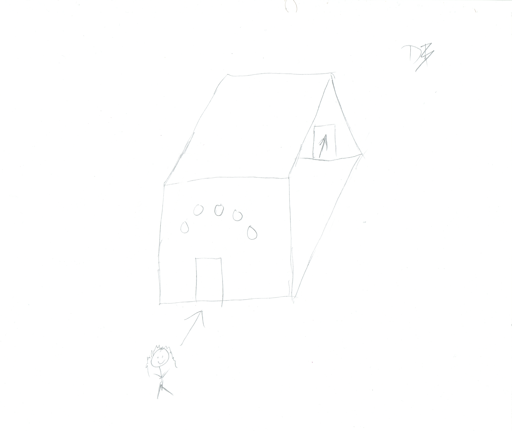

# Udacity Puzzler VR
**David's Puzzler Project**

My goal for this project was to learn the concept of Virtual Reality design and how to perform user testing to make my VR product more enjoyable for my target audience. I created a 3D simon says puzzle the player has to solve in order to escape a partially lit dungeon for mobile VR headsets.

**Puzzler**

I was successful in creating a comfortable VR experience for my players. The user given the opportunity to try the puzzle has given it positive remarks. The objectives of the puzzle were clear to the end user and they had a good time interacting with the orbs. 

Click [HERE](https://youtu.be/nOCuFyaqBsw) for a mobile playthrough video.

Persona:

**Story of the process**

Here is some concept art I created for the design for my puzzler

**User testing outcomes and iteration**

User Test 1

With the first user test, the tester found the player view was brushing against the doorway and so I had to adjust the positioning of the camera.

Final User Test

During the final user test, the player noticed some problems with lighting when I tried experimenting with flickering torches. I ended up reverting back to static lights due to the performance hit and loss of frames we were experiencing.

**Breakdown of final piece**

**Conclusion**

My experience of VR design and user testing has taught me plenty of techniques I can use for future projects. I find that creating a product is even better than playing someone else's because I am able to create a fun experience for others to enjoy.

**Next Steps**

To create replayability, I can expand the dungeon to create other simple puzzler's and allow the player to move room to room solving each of them with various difficulty settings.
